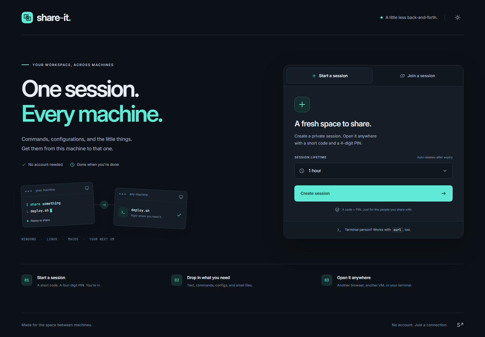

<p align="center">
  
</p>

<h1 align="center">Share-It</h1>

<p align="center">
  <strong>Your workspace, across machines.</strong><br />
  Commands, configurations, and the little things.<br />
  Get them from this machine to that one.
</p>

<p align="center">
  <a href="#get-started">Get started</a> &middot;
  <a href="#terminal-access">Use your terminal</a> &middot;
  <a href="#self-host">Self-host</a> &middot;
  <a href="#documentation">Explore the docs</a>
</p>



<p align="center">
  <strong>No account needed &nbsp; &middot; &nbsp; Browser + terminal &nbsp; &middot; &nbsp; Self-hosted</strong><br />
  Windows &nbsp; &middot; &nbsp; Linux &nbsp; &middot; &nbsp; macOS &nbsp; &middot; &nbsp; Your next VM
</p>

## One session. Every machine.

A command on your laptop. A config needed on a server. A small file headed to a fresh VM. Share-It gives those everyday handoffs a temporary shared workspace: open a session, drop in what you need, and pick it up on another machine.

Built for developers, administrators, and anyone whose work spans more than one screen.

| A little less back-and-forth | How Share-It helps |
|---|---|
| **Start with a code, skip the signup** | Create a session and join from another browser with a short code and four-digit PIN. |
| **Keep the little things together** | Save text, commands, and configurations alongside small files. Copy exact saved content or download what you need. |
| **Pick up the latest saved version** | Saved changes appear in connected browsers. Conflict handling preserves your draft when someone else saves first. |
| **Bring your terminal** | Read snippets and download files with `curl`, with commands for Bash/macOS, PowerShell, and Windows CMD. |
| **Make room for temporary work** | Choose a session lifetime of 1, 4, 8, or 24 hours. Access ends at expiry, and automatic cleanup takes care of the contents. |
| **Keep it on your infrastructure** | Host on your own server or private LAN. Browser assets, fonts, storage, and cleanup are local. |

A calm charcoal-and-teal interface keeps the workspace focused, with Dark, Light, and System themes and a responsive layout for smaller screens.

## Share in three steps

1. **Start a session.** Choose a lifetime and create your workspace. Keep the code and PIN handy; the PIN is shown only once.
2. **Drop in what you need.** Save a snippet or drag in a file. Uploads include progress and cancellation.
3. **Open it on another machine.** Join in a browser with the code and PIN, or use the workspace's generated `curl` commands to read and download.

All joined browser participants can manage content, change expiry, or end the session. Terminal access is read-only.

## Get started

With a .NET 10 SDK installed, run these commands from the repository root:

```powershell
dotnet restore
dotnet run --project src/ShareIt.Web --environment Development --urls http://localhost:5180
```

Open **[localhost:5180](http://localhost:5180)** and create your first session. Open the same server from another browser to join it.

The SQLite schema migrates automatically. Local data, files, a random PIN pepper, and cookie-protection keys are created in `src/ShareIt.Web/.runtime/`, which is ignored by Git. HTTP is for local development; use HTTPS for deployment.

## Terminal access

**The snippet you saved in your browser, right where your terminal needs it.**

Replace the example host and session code with your own. Enter the session PIN when `curl` prompts for a password.

```bash
# See the session's text and file listing
curl --fail --user w3r-yub 'https://share.example.com/api/v1/sessions/w3r-yub'

# Read an exact saved snippet
curl --fail --user w3r-yub 'https://share.example.com/api/v1/sessions/w3r-yub/texts/1/raw'

# Download a file
curl --fail --user w3r-yub 'https://share.example.com/api/v1/sessions/w3r-yub/files/1' --output config.json
```

Select **Bash / macOS**, **PowerShell**, or **Windows CMD** in the interface to copy a command for your terminal. Use `curl.exe` in Windows PowerShell. Keep the PIN out of URLs and command arguments.

<details>
<summary><strong>Windows Command Prompt example</strong></summary>

In `cmd.exe`, use double quotes; single quotes become part of the URL:

```bat
curl.exe --fail --user w3r-yub "https://share.example.com/api/v1/sessions/w3r-yub/texts/1/raw"
```

Generated CMD file commands use a `download-<number>` filename when the original name contains variable expansions or characters Windows cannot use in a filename.

</details>

See the [HTTP API guide](docs/api.md) for endpoints, authentication, and response details.

## Self-host

### On your private network

**Your machines. Your network. Your workspace.** Share-It can run entirely on a LAN, without an internet connection at runtime. Clients need to reach the LAN server and trust its HTTPS certificate.

Follow the **[offline deployment guide](docs/offline-deployment.md)** to transfer prebuilt images and configure private HTTPS with a local certificate authority. The offline Compose configuration disables image pulls and isolates the app behind its LAN-facing proxy.

### On a public HTTPS server

For the existing VM at `172.16.16.106:8083` behind `https://share-it.sherif.online`, follow the [VM and reverse-proxy guide](deploy/http/README.md) to keep LAN access and public HTTPS available together.

1. Point a domain to a Linux server and allow incoming TCP 80/443. UDP 443 is optional.
2. Copy [`deploy/.env.example`](deploy/.env.example) to `deploy/.env` and set the domain and certificate contact email.
3. Start the stack from the repository root:

```bash
docker compose --env-file deploy/.env -f deploy/compose.yml up -d --build
```

Caddy supplies HTTPS and forwards WebSockets. Only Caddy exposes ports. The app runs as a non-root user, with persistent named volumes for data and secrets.

Deploy exactly **one application instance** with the current SQLite storage and in-process coordination. If the configured Docker subnet conflicts with your network, change both the subnet/Caddy address and `ShareIt__TrustedProxy` together.

<details>
<summary><strong>Configuration, capacity, and retention</strong></summary>

Override `Limits` and `ShareIt` settings with normal .NET configuration, such as `Limits__MaxFileBytes` or `ShareIt__DataPath`.

| Setting | Default |
|---|---|
| Session lifetime | 1 hour; maximum 24 hours from creation |
| File size | 25 MB per file |
| Files per session | 50 files, 100 MB total |
| Text per session | 100 cards, 64 KiB per card, 2 MiB total |
| Global file budget | 2 GiB |

Pending uploads and undeleted files continue counting against quotas.

Ending a session closes access immediately. You can request immediate deletion or retain inaccessible data until expiry. The cleanup worker checks every minute and on startup; explicit deletion wakes it immediately. Failed deletions are retried with durable state. Expiry and closure block requests immediately, even while physical cleanup is pending.

Keep data and secret volumes private. PIN verification requires its pepper; browser cookies require the Data Protection keyring. Losing either invalidates the corresponding access mechanism. Do not back up temporary contents unless you explicitly choose a retention policy. `docker compose down` retains data; `down -v` removes it.

</details>

### Temporary by design

PINs are stored as salted, peppered hashes, and failed PIN attempts are limited. The trusted server can read shared content; Share-It does not provide end-to-end encryption. Cleanup removes stored contents through normal database and filesystem deletion and cannot retract copies already downloaded. See the [session lifecycle](docs/session-lifecycle.md) for the full behavior.

## Built for a focused job

Share-It uses **.NET 10**, **Blazor Interactive Server**, **EF Core**, and **SQLite**, with clear boundaries between application rules, storage, and the interface.

| Project | Responsibility |
|---|---|
| `ShareIt.Core` | Provider-neutral rules, models, contracts, and services |
| `ShareIt.Infrastructure` | EF Core persistence, local file storage, PIN hashing, and cleanup |
| `ShareIt.Web` | Blazor interface, HTTP authentication, endpoints, and live notifications |

<details>
<summary><strong>Run the verification suite</strong></summary>

```powershell
dotnet test ShareIt.sln --filter "FullyQualifiedName!~BrowserTests"
# Install browser engines once (use pwsh on Linux/macOS):
powershell -ExecutionPolicy Bypass -File tests/ShareIt.Web.Tests/bin/Debug/net10.0/playwright.ps1 install chromium firefox webkit
dotnet test tests/ShareIt.Web.Tests --filter "FullyQualifiedName~BrowserTests"
```

Browser tests cover Chromium, Firefox, and WebKit, start a local server with isolated test data, and generate review images in `.artifacts/screenshots/`. Set `SHAREIT_E2E_URL` to test an already-running local instance instead. Synthetic test content never contains real credentials.

See [verification notes](docs/verification.md) for coverage, recorded results, and local preview details.

</details>

<details>
<summary><strong>Extend storage or change the schema</strong></summary>

The supported portability target is another relational database, with PostgreSQL first. Provider changes require their own migrations and data transfer; they are not a configuration-only switch. Object-storage adapters implement `IFileStore` and must pass the same behavioral tests. Multiple application instances also require distributed coordination, notifications, and throttling.

To create a schema change:

```powershell
dotnet tool restore
dotnet ef migrations add ChangeName --project src/ShareIt.Infrastructure --startup-project src/ShareIt.Web --output-dir Persistence/Migrations/Sqlite
```

</details>

## Documentation

| Guide | Explore |
|---|---|
| [Offline deployment](docs/offline-deployment.md) | Private LAN hosting, prebuilt images, and local HTTPS |
| [HTTP API](docs/api.md) | Endpoints, terminal authentication, and downloads |
| [Session lifecycle](docs/session-lifecycle.md) | Expiry, closure, retention, and cleanup |
| [Architecture](docs/architecture.md) | Project structure, storage contracts, and extension points |
| [Brand and interface](docs/brand-and-ui.md) | Visual identity, themes, and interaction principles |
| [Verification](docs/verification.md) | Test coverage, recorded results, and preview setup |

Licensed under [Apache 2.0](LICENSE).

---

<p align="center"><strong>Made for the space between machines.</strong></p>
